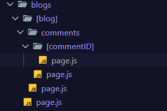

# Routing in next

our data load on children component on page.js

we can directly add routing in next js without any external libraray

like if i want to add about page routing then

1. create a about folder inside app folder.
2. create a page.js. (the name should be page.js by default any other name like about.js or anything will throgh error.)
3. write code inside page.js.
4. simply search localhost:3000/about
5. it will load that.

code ex:

```js
import React from "react";

export default function About() {
  return (
    <div>
      <h1>This is About page</h1>
    </div>
  );
}
```

### Navigation

for navigation we can use next link tag

ex:

app
page.js

```js
import Image from "next/image";
import Link from "next/link";

export default function Home() {
  return (
    <h1>
      Hey there! Welcome to Next.js! click the links above to navigate to
      different pages.
      <h2>
        <Link href="/about">About</Link>
      </h2>
      <Link href="/services">services</Link>
    </h1>
  );
}
```

````md
app
about
page.js

```js
import React from "react";
import Link from "next/link";

export default function About() {
  return (
    <div>
      <h1>This is About page</h1>
      <Link href="/">Go back to home</Link>
    </div>
  );
}
```
````

````md
app
service
page.js

```js
import Link from "next/link";

function services() {
  return (
    <div>
      <h2>This is services page.</h2>
      <Link href="/">Go back to home</Link>
    </div>
  );
}

export default services;
```
````

### Nested routing

nested routing means routing under another routing

ex:

home
services
app services

to create nested we can simply create multiple folders with pages.
ex:

on services page

```js
<div>
  <h1>Technical agency</h1>
  <h2>
    <Link href="/about">About</Link>
  </h2>
  <Link href="/services">services</Link>
  <p>
    <Link href="/services/web-dev">All services</Link>
  </p>
  <p>
    <Link href="/services/Seo">Seo</Link>
  </p>
</div>
```

also the folder name is case sensitive in this type of routing.

# Dynamic routing :

dynamic routes mean multiple blogs page inside main blog

to do so we create a folder inside the blog folder but that name should start with [anyName]

ex:

      blogs folder name
        [blog] folder name => anything written inside [] is called slug
          page.js file name

          ```js
              import React from "react";

            async function page1({ params }) {
            console.log(await params);
            const { blog } = await params;
            return (
            <div>
            <h1>This is child blog1</h1>
            <p>Blog id : {blog}</p>
            </div>
            );
            }

            export default page1;
            // basically now we can go to any no. of route from here
            // http://localhost:3000/blogs/1 http://localhost:3000/blogs/2 ect.

          ```

- yhan url me agr hm ye type kren to ye child page pe le jaaega or vhan parama ki value

-      http://localhost:3000/blogs/sim

  {blog: 'sim'}
  [folder] name : jo url me dala

whenever we make components then in every components we receive props

```js
import Link from "next/link";

export default function Home(props) {
  console.log(props);
  return (
    <>
      <h1>Technical Agency</h1>
      <p>
        <Link href="/blogs">Blogs</Link>
      </p> <p>
        <Link href="/about">About</Link>
      </p> <p>
        <Link href="/services">Services</Link>
      </p>
    </>
  );
}
```

```js
export default function Home(props) {
  console.log(props);
}
```

### props

- it have bydefault 2 values params and search params.
- both are promises.

to acess the searchparams we can use .then() or async await

### Nested Dynamic routes

- adding comments feature on blog.
- we will create another directory named comments inside [blog]
- and inside the [comments] we will we will create page.js

- folder structure :

```pgsql

blogs

  [blog]
  page.js
    comments
      page.js

```

basically in `next js ` this is a rule that for routing the child folder file name must be `page.js`

- to create a nested dynamic route it's bery simple just do this folder structure

```bash
  blogs
    [blog]
      page.js
      commnets
        page.js
        [commentsID]
            page.js

```



---

# Catch all routes

- creating a diffrent functionality like koi esa path images/png/test etc for file mamager.
- jis bhi path pr user jaa rha hai vo path show krenge error nhi aana chahiye
- this is dynamic route we can go to any page using this route. also can catch all types of nested routes. basically hardcoded nhi hota.
- iske liye hm app me special folder bnaenge
  [...filePath] : name kuch bhi ho skta hai bs `...` se start hona chahiye.
- then page.js file

ex:

```js
import React from "react";

async function File({ params }) {
  console.log(await params);
  const { filePath } = await params; // this gives array
  // jo bhi url pe as / likhnge routes me vo values filePath me as array values aa jaaengi.
  //   filePath: ['images.png'] // yhan file path isliye hai kyonki folder ka name filePath hai.

  return (
    <div>
      <h1>This is catch all rutes</h1>
      <p>
        Blog id : <i> {filePath.join("/")}</i>{" "}
      </p>
    </div>
  );
}

export default File;
```

- here we can seperate path by creating a files folder and then inside that create catch all routes

```bash
  files
  page.js
    [...filePath]
      page.js

```

- now here we can create a page.js on files folder so that if user fo to files it should not give error.

or we can use `optional catch all routes`.

### optional catch routes

esa krne ke liye hm [...filePath] ko nested [[...filePath]] me likh skte han.

```bash
  files
   [[...filePath]]
      page.js

```

now agr ab user files pe jata hao to 404 ki jagah vo directly [[...filePath]] ke ander jo page.js hai vo load krega.

```js
import React from "react";

async function File({ params }) {
  console.log(await params);
  const { filePath } = await params;
  //   filePath: ['images.png']

  return (
    <div>
      <h1>This is catch all rutes</h1>
      <p>
        Blog id : <i> {filePath?.join("/")}</i>{" "}
      </p>
      {/* this is dynamic route we can go to any page using this route. also can catch all types of nested routes. */}
    </div>
  );
}

export default File;
```

yhan hm optional routes ko same level pe nhi rkh skte means ab mai root level app ke ander optional routes nhi bna skta.

root level pe optional catch wala route define krenge to vo / route ke sath conflict krega.
kyonki / pe bhi ye open hona chahiye pr vo home ke liye reserve hota hai.

agr original app ke page ko delet krenge to ye chal jaaega.

### Reusable Layouts in Next (node s2 ep 6)

- creating common layouts ex: header footer navbar etc which are common on all the pages.
- for this we have a default js file layout.js
- the layout.js file code render on all the routes which ever we use.
- this is basically the root file where our other js files code render as inside children prop.

ex :

```js
return (
  <html lang="en">
    <body className={`${geistSans.variable} ${geistMono.variable} antialiased`}>
      <h1>Root layout</h1>
      {children}
    </body>
  </html>
);
```

- here we can write our header and footer and they will render on all the pages.

```js
return (
  <html lang="en">
    <body className={`${geistSans.variable} ${geistMono.variable} antialiased`}>
      <header className="bg-white/50 text-black">header</header>
      <h1>Root layout</h1>
      {children}

      <footer className="bg-teal-500 text-black">footer</footer>
    </body>
  </html>
);
```

### adding layout.js inside another route

same we can do for service folder inside which if i want top bottom.

services
page.js

```js
import React from "react";

const Serviceslayout = ({ children }) => {
  return (
    <div>
      {children}
      <h1>This is services layout</h1>
    </div>
  );
};

export default Serviceslayout;
```

- now this serviceLayout will found on evry child components of the services.
- we cant have HTML tag inside a layout.js which is not on root level.
- hm meta deta `title` ko directly nhi likhenge.


# 